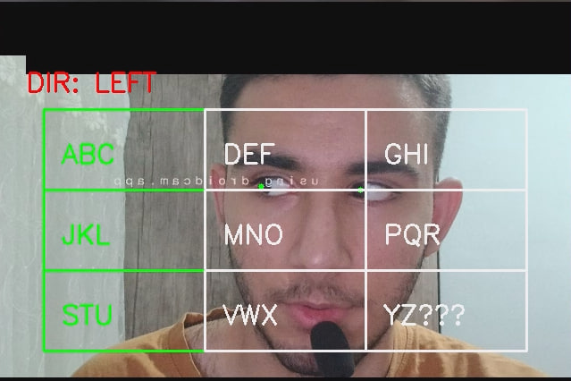
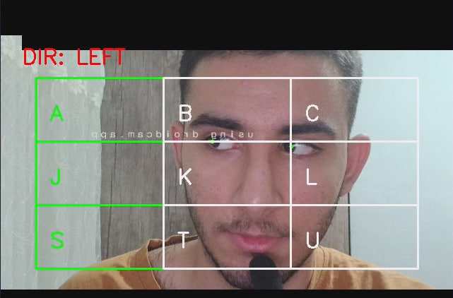
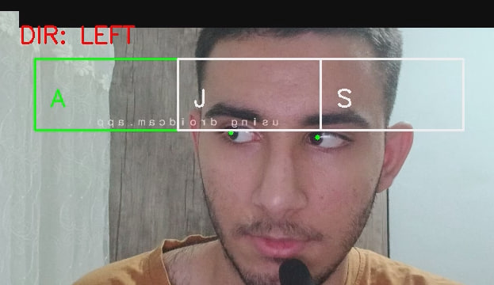
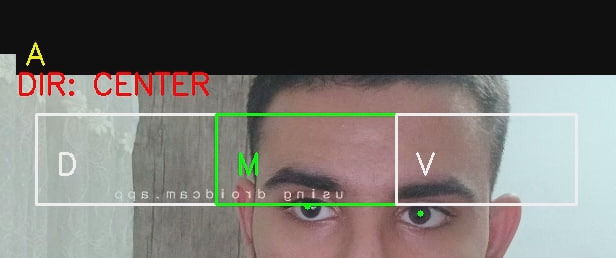

# 📍Eye Tracking Keyboard

A practical project that allows **typing text using only your eyes**.  
This project uses eye-tracking sensors and lets users type on a computer **without touching the keyboard**.

**NOTE: THIS VERSION DOES NOT HAVE SPACE CHARACTER YET.**

## 💡 Features

- Type text just by looking at the keys
- Simple user interface
- Adjustable gaze sensitivity
## ⚙️ Requirements
- Python 3.8+
- Python libraries:
```bash
pip install opencv-python
pip install mediapipe
pip install numpy
```
## 📸 Screenshots

<h2><i>LEVEL 1 Selection</i></h2>



<h2><i>LEVEL 2 Selection</i></h2>



<h2><i>LEVEL 3 Selection</i></h2>



<h2><i>And It Will Type The Selected Letter</i></h2>



## 💠 How To Use 

- Go to project's folder in CMD and run program by

```
- python eye_tracking.py
```
- Select your column with looking LEFT/RIGHT/CENTRE <br>
(**IT NEEDS A LITTLE GAZE TO SELECT**) <br>
- YOU CAN CONTROL DWELL TIME BY CHANGING **DWELL_TIME** AMOUNT IN THE ```eye_tracking.py``` FILE
- YOU CAN CONTROL YOUR EYES THRESHOL BY ADJUSTING **left_threshold** AND **right_threshold** AMOUNT IN THE ```eye_tracking.py``` 
- NOTE THAT: IF YOU SET **left_threshold** TO FOR EXAMPLE 0.3 YOU NEED TO CHANGE **right_threshold** TO 0.7, <br>
AND IF YOU CHANGE THE **left_threshold** TO 0.2 YOU NEED TO CHANGE **right_threshold** TO 0.8


## ⚡ Tips

- Ensure proper lighting for better eye detection

- Best results with webcam resolution 720p+ (do not worry if you have less)

## 🪪 License

[MIT](https://choosealicense.com/licenses/mit/)

